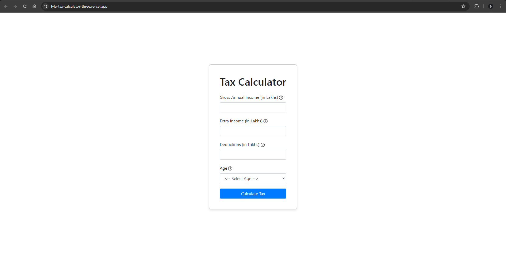
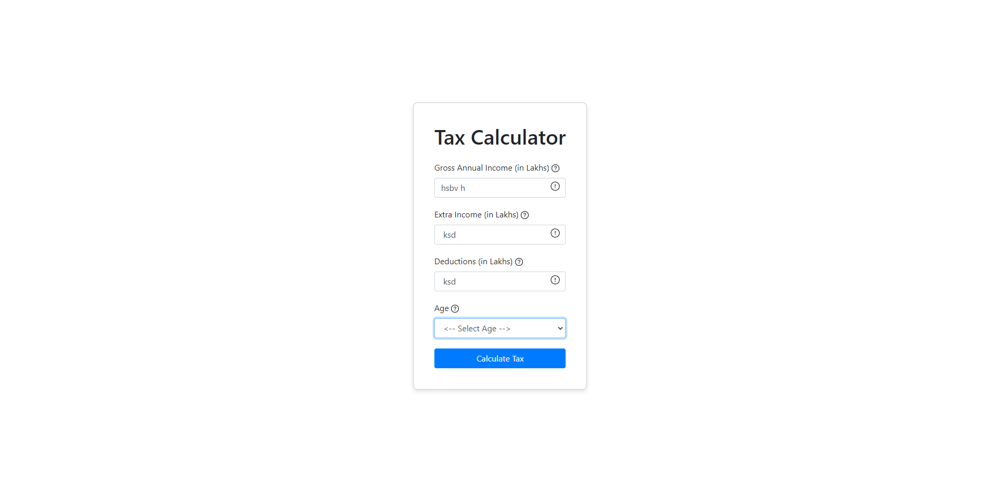
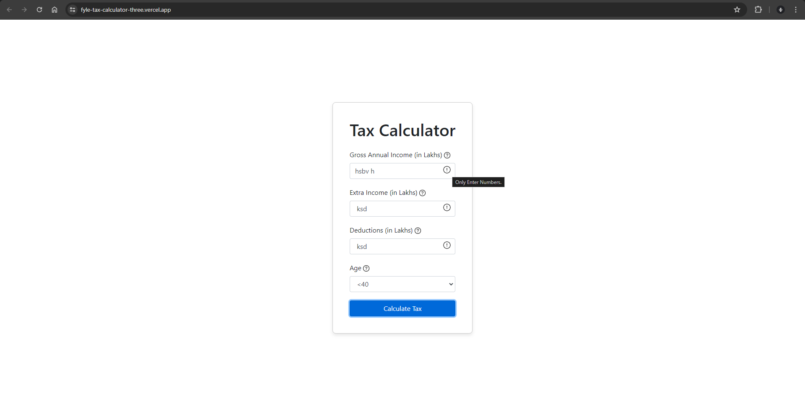
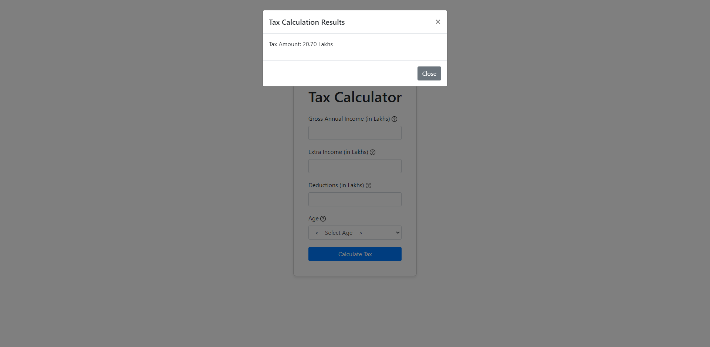

## Tax Calculator Web Application

This project is a web-based tax calculator designed as part of the Fyle Web Development Internship Challenge. The application allows users to input their annual income, additional income, deductions, and age category to calculate their tax liability based on predefined tax rules.

### Features:

- Calculates tax based on income, deductions, and age category.
- Validates user inputs and displays error icons with tooltips for incorrect entries.
- Provides a user-friendly interface with Bootstrap for layout and styling.
- Displays results in a modal with the calculated tax amount.

### Technologies Used:

- HTML, CSS, JavaScript
- Bootstrap
- jQuery

### Instructions to Run Locally:

1. Clone the repository: `git clone https://github.com/MuhammedBasith/fyle-tax-calculator.git`
2. Open `index.html` in a web browser.

### Project Screenshots:

- **Home Page**
  

- **Error Icon**
  

- **Error Tooltip**
  

- **Result Modal**
  